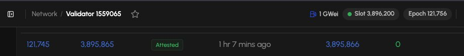

# node-operator

[](https://github.com/s1ns3nz0/node-operator-public/actions/workflows/continuous-integration.yml)
[](LICENSE)
[](https://github.com/s1ns3nz0/node-operator-public/commits/main)
[](https://github.com/s1ns3nz0/node-operator-public/issues)

보안 설계를 우선한 AWS EKS 환경에서 **Prysm(consensus) + Nethermind(execution)** 기반 **Hoodi 테스트넷 Validator**를 운영하는 실습 프로젝트입니다.



## 목적

- AWS EKS 위에 Hoodi Validator를 안전하게 구축·운영하는 방법을 실습
- 키 커스터디(Vault), 서명 방어(Fence), 아티팩트 무결성(Cosign/SBOM) 등 **보안 설계를 최우선**으로 반영
- 검증 가능한 CI/CD 파이프라인을 통해 신뢰할 수 있는 배포 절차를 제공

## 설치

```bash
bash scripts/release/node-operator-install.sh
```

인자 없이 실행하는 단일 진입점입니다. AWS CLI 프로필/리전을 자동으로 감지하고, 로컬 릴리스 번들을 검증한 뒤 배포에 필요한 값만 대화형으로 입력받습니다.

사전 준비물: AWS CLI 프로필, Docker, `git`/`jq`/`terraform`/`kubectl`/`python3`/`gh`. macOS는 Cosign이 없으면 Homebrew로 자동 설치합니다.

자세한 운영 경계와 정리(teardown) 절차는 [`docs/operations/release-bootstrap.md`](docs/operations/release-bootstrap.md)를 참고하세요.

## 보안

- CI/CD 통제 목록: [`docs/security/ci-cd-security-controls.md`](docs/security/ci-cd-security-controls.md)
- 통제별 구현 상세: [`docs/security/ci-cd-security-control-implementation.md`](docs/security/ci-cd-security-control-implementation.md)
- 위협 모델: [`THREAT-MODEL.md`](THREAT-MODEL.md)

라이선스는 [Apache-2.0](LICENSE)입니다.
