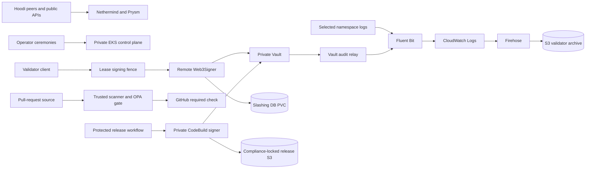

# Node Operator Repository Threat Model

Analysis date: 2026-09-11

Repository revision: `990fc716bdf21e5ab5958b77928b62ead66a4b5d`

Scope: full repository, static evidence only

## 1. Overview

Node Operator is a repository-defined operating system for a read-only Hoodi Ethereum node and a separately activated validator stack on private Amazon EKS. Terraform builds the AWS network, EKS, IAM, KMS, S3, CloudTrail, recovery, and private release boundaries. Kubernetes manifests and renderers define Nethermind, Prysm, Vault, Web3Signer, PostgreSQL slashing protection, a signing-fence proxy, and a privileged Fluent Bit collector. Shell and Python operations scripts perform guarded ceremonies and emit lifecycle evidence. GitHub Actions scans, builds, signs, and promotes immutable release inputs.

The design deliberately separates execution and beacon clients from validator custody. Validator clients have no key mount or direct Vault access. A set-scoped remote signer obtains short-lived Vault identity, the signing fence requires ownership of an exact Kubernetes Lease before passing the end-to-end TLS stream, and the slashing database is retained across workload replacement. Vault also signs release provenance through a private CodeBuild path. Runtime logs and Vault audit events flow through CloudWatch and Firehose into a private S3 archive.

The primary security goals are to prevent unauthorized or duplicate validator signing; keep validator, Vault, cloud, and release credentials confidential; preserve slashing history and recovery state; bind releases and evidence to exact immutable subjects; and retain complete, attributable audit records without retaining secret values.

## 2. Threat model, trust boundaries and assumptions

### Assets and security goals

- Validator custody material: EIP-2335 keystores, passwords, withdrawal credentials, BLS signing authority, and voluntary-exit authority.
- Slashing safety state: the PostgreSQL slashing database, retained PVC identity, fencing Lease state, and handover evidence that prevents two active signers.
- Vault security state: Raft data, unseal/recovery material, generated root tokens, auth roles, policies, PKI keys, release Transit keys, and audit-device continuity.
- Kubernetes authority: projected service-account tokens, set-scoped Roles, Pod identity, immutable selectors, NetworkPolicies, and the private EKS API.
- AWS authority and evidence: IAM roles and OIDC trusts, KMS keys, Terraform state, CloudTrail and S3 access logs, validator evidence, Vault snapshots, and Object-Lock retention.
- Software supply chain: default-branch CI control code, pinned actions and container digests, scanner policy, release bundles, SBOMs, provenance, signatures, and private ECR/OCI subjects.
- Operator host integrity: local ceremony inputs, private-cluster sessions, temporary custody files, Terraform plans, and generated non-secret evidence.
- Availability: Hoodi execution/beacon sync, validator duties, Vault availability, signer and slashing database continuity, and evidence recovery.

### Trust boundaries and input classes

**External and attacker-controlled inputs**

- Hoodi peer traffic and public execution/beacon data enter Nethermind and Prysm over the restricted P2P/runtime network boundary.
- Public Beaconcha.in and operator-selected HTTPS JSON-RPC responses enter `scripts/ops/observe-external-hoodi-validator.sh`; these are untrusted corroboration data.
- Pull-request commits, repository file contents, scanner findings, Terraform configuration, and upstream `workflow_run` event metadata enter GitHub Actions from a contributor-controlled revision.
- Container stdout/stderr in the `node-operator`, `validator-operations`, and `vault` namespaces enters Fluent Bit through the node `/var/log` hostPath.
- Vault file and Unix-socket audit records enter `cmd/vault-audit-relay`; record bodies originate in Vault but delivery timing can be affected by pod, node, storage, or process failure.
- JSON evidence records supplied to validators, manifest builders, index builders, reconciliation, and restore verification may originate in operator tools or a compromised evidence producer.

**Operator-controlled inputs**

- CLI flags, environment variables, Terraform variables, tfvars, backend configuration, output/evidence directories, validator-set IDs, public keys, image digests, API endpoints, CA paths, and approval identifiers.
- Kubernetes/Vault ceremonies, scaling and fencing operations, recovery grants, audit-device configuration, snapshot destinations, and private network sessions.
- Rendered manifests and replacements for placeholders such as validator set, public key, ECR digest, Kubernetes API CIDR, and private service identity.

Operator-controlled values are not treated as anonymous remote attacker input. They remain security boundaries because compromise of the operator workstation, CI control plane, deployment identity, or GitOps source can convert them into attacker control.

**Developer-controlled inputs**

- Source code, pinned workflow definitions, scanner policy, Terraform modules, Kubernetes templates, Vault policies, Dockerfiles, and test fixtures.
- Dependency versions, release allowlists, image source manifests, action SHAs, container digests, and the repository-pinned harness.

**Cloud and platform-controlled inputs**

- GitHub event payloads and API responses, AWS STS/OIDC claims, EKS Pod Identity credentials, Kubernetes API objects, Vault API responses, CloudWatch delivery batches, S3 version/retention metadata, and KMS metadata.

### Threat actors

- An external network attacker or hostile Hoodi peer that can send protocol traffic but has no private-cluster identity.
- A pull-request author controlling a fork or branch revision but not the protected default branch or repository secrets.
- A compromised workload in a project namespace, including one able to write crafted log lines.
- A compromised validator client, signer, log collector, or Vault sidecar constrained by its current service account, filesystem, and NetworkPolicy.
- A malicious or compromised operator, Terraform runner, GitHub trusted workflow, AWS administrator, or Kubernetes deployment controller.
- A dependency or image supply-chain attacker attempting to replace a tool, action, chart, container, or release artifact.
- An accidental operator error that violates a custody, evidence, retention, or failover invariant.

### Assumptions and scope

- This model evaluates source and declared configuration at the named revision. It does not claim the controls have been applied, enabled, or observed in a live AWS, EKS, Vault, GitHub, or Hoodi environment.
- The EKS API, Vault service, CodeBuild signer, GitOps endpoints, and Kubernetes services are intended to remain private. A public exposure, disabled VPC CNI policy enforcement, broader IAM grant, or mutable image/tag changes the calibration.
- The reviewed manifests are the production contract. Several CLI flags become materially more dangerous if another deployment path exposes them to remote input or permits arbitrary mounts/egress.
- NetworkPolicy enforcement depends on the EKS VPC CNI add-on configuration. IAM, Vault policy, TLS, service selectors, and application checks remain independent controls.
- Public explorers and RPC endpoints are availability and integrity dependencies for corroboration only. Internal Prysm state remains operational truth and external responses do not start or stop duties.
- Repository security documentation is treated as a design and risk-acceptance record, not proof of branch settings, CODEOWNERS enforcement, deployed bucket policy, or successful CI execution.
- No cross-language FFI, native bridge, browser rendering, SQL construction from remote requests, or general public web application was found in repository-owned code.
- Deployment, publication, merge, production access, secret access, secret mutation, and remediation are outside this task.

## 3. Attack surface, mitigations and attacker stories

### 3.1 Validator signing fence (`cmd/validator-signing-fence`, `deploy/validator/client-lease-fence-template.yaml`)

**Surface:** The fence exposes a TCP TLS pass-through listener, an HTTP health listener, a local signer upstream, and a Kubernetes Lease/Pod client. Its command line selects listen addresses, upstream, Lease identity, time bounds, the Kubernetes API, the projected token path, and the CA path. Lease state, Pod UID, Pod name, source address, connection age, and Kubernetes response timing decide whether an accepted stream remains open.

**Confirmed findings:**

- **TM-001 — Configurable signing-fence token path can turn any readable file into a bearer credential (MEDIUM, open).** `--token-path` at `main.go:557` flows through `readToken` at lines 521-528, becomes the Authorization header at line 115, and reaches `httpClient.Do` at line 120. Historical review rated the underlying G304 condition Medium; this model preserves that calibration because the production manifest fixes a read-only projected token path and exploitation requires workload-command control.
- **TM-002 — Configurable Kubernetes API and CA can redirect the projected fence token (MEDIUM, open).** `--kube-api` and `--ca-path` at lines 551 and 558 flow into a custom RootCAs pool at lines 531-544 and a token-bearing request at lines 106-120. HTTPS is required, malformed PEM is rejected, and the manifest plus egress policy fix the destination and trust anchor; a deployment controller can still replace both inputs.

**Mitigations and controls:**

- The exact Lease and client Pod names are set-specific. Namespace/name path components use `url.PathEscape`, Pod UID binds holder identity, and malformed/stale/future Lease state fails closed.
- The proxy closes its listener and active connections on renewal failure, conflict, API failure, health-server failure, safety-margin breach, or maximum connection age.
- The reviewed Pod is non-root, capability-free, read-only-root, resource-bounded, and uses a ten-minute projected token with one-Lease/one-Pod RBAC.
- The validator client can reach only the set-scoped fence service; the fence can reach only the corresponding signer, DNS, and the declared Kubernetes API CIDR.
- The image path has unit, black-box, SAST, DAST, SBOM, provenance, signature, and exact-revision gates. These are design controls; successful live CI remains a separate fact.

**Attacker stories:** A deployment controller changes `--token-path` to an unintended readable file, causing its bytes to leave as a bearer header (TM-001). The same class of controller can replace both the API hostname and CA so the legitimate projected token is sent to an attacker TLS endpoint (TM-002). Neither path is reachable through the fence's network listeners alone.

### 3.2 Validator runtime, custody, and slashing protection (`deploy/validator`, `deploy/validator/vault`, `scripts/ops`)

**Surface:** Web3Signer consumes Vault-injected keystore, password, TLS, and database material. PostgreSQL preserves slashing history on an encrypted retained PVC. Operators render set-specific manifests, stage zero-replica workloads, acquire/release a Lease, activate clients, migrate slashing state, revoke Vault roles, and perform UC-5 recovery.

**Risks:** A wildcard Vault policy, cross-set service selector, direct client-to-signer route, missing Lease fence, stale slashing database, or unsafe recovery order could produce unauthorized or slashable signatures. A signer or sidecar compromise could expose injected files or use current signing authority. Operator scripts carry high-impact authority even when they emit only public evidence.

**Mitigations and controls:** Set-specific Vault paths and Kubernetes auth roles use short-lived audience-bound tokens with no default policy. The client has no keystore or Vault egress. Services include validator-set selectors. Workloads start at zero replicas and activation checks require identity, readiness, fence, and slashing-state evidence. PVC retention, versioned Vault records, fail-closed ceremonies, private transport, and explicit approval IDs reduce accidental handover.

**Attacker story:** A compromised validator client attempts a direct signer or Vault request. Default-deny NetworkPolicy, service separation, lack of credentials, mTLS, and the fence should block it. If deployment RBAC can replace selectors, policies, or injected roles, that actor has crossed the workload-administration boundary and can invalidate several independent controls; this model therefore treats least-privilege deployment authority as a critical precondition rather than claiming manifest text alone prevents compromise.

### 3.3 Lifecycle evidence producers and validators (`deploy/observability/evidence-envelope.schema.json`, `scripts/ops`)

**Surface:** Local scripts emit UC-1 through UC-5, source-disagreement, and archive-manifest JSON. Validators accept evidence files, manifest builders hash them, index builders select public fields, reconciliation compares internal and external observations, and restore tools verify hashes and record schemas.

**Confirmed finding:**

- **TM-003 — Evidence validation rejects sensitive field names but accepts sensitive values (MEDIUM, open).** The schema constrains `payload` only to an object. The shell validator recursively checks object keys for secret-related words, not values. A credential under `payload.note` passes, is declared non-secret, is hashed into the archive manifest, and passes restore validation. A focused local probe reproduced this behavior on the analyzed revision.

**Mitigations and controls:** Top-level fields are closed and strongly formatted. Known sensitive key names are rejected at all depths. Search indexing selects a small public field set rather than copying payloads. Manifests record basename, SHA-256, event type, and correlation ID. Restore rejects unsafe filenames, mismatched hashes, malformed envelopes, oversized/decompression-bomb Firehose archives, and unexpected metadata structure.

**Attacker story:** A compromised producer or operator mistake places a Vault token or recovery phrase under an innocuous key. The current validator certifies the file as safe and downstream integrity checks faithfully preserve the unsafe record (TM-003). The integrity controls make later tampering harder but cannot establish that a weakly typed payload was non-secret when first admitted.

### 3.4 Logging and Vault audit relay (`deploy/observability`, `cmd/vault-audit-relay`)

**Surface:** A root-running Fluent Bit DaemonSet mounts every node's `/var/log` read-only, reads Kubernetes metadata using cluster-wide get/list/watch, and uses EKS Pod Identity to write two CloudWatch groups. It filters records after collection to three namespaces. Vault writes HMAC-redacted records to a PVC file and Unix socket; the relay validates JSON, adds source provenance, and emits both streams to stdout.

**Confirmed findings:**

- **TM-004 — Namespace-wide raw container logs are retained in the immutable validator archive (MEDIUM, open).** `/var/log/containers/*.log` flows through a namespace-only filter to CloudWatch. Empty subscription patterns forward every record through Firehose to the two-year Object-Lock bucket. This is inconsistent with the declared public-only archive boundary if a selected workload logs a credential or raw value.
- **TM-005 — Vault audit relay restart skips unacknowledged file-device records (MEDIUM, open).** `tailFile` opens the PVC file and seeks to EOF on every successful open without a persisted cursor or downstream acknowledgement. Records accumulated while the relay is absent are skipped from stdout, CloudWatch, and Firehose even though the local PVC still holds them.

**Mitigations and controls:** The DaemonSet exception is tightly named by admission policy, permits only one read-only `/var/log` hostPath, drops capabilities, uses a read-only root filesystem, and has resource bounds. Its IAM role can write only the two log groups. Default-deny egress admits only DNS, the Kubernetes API service address, Pod Identity, and private VPC endpoints. Vault audit devices set `log_raw=false`, `elide_list_responses=true`, and HMAC redaction. The relay bounds record size, rejects non-JSON, prevents concurrent stdout interleaving, and keeps an open descriptor at EOF to avoid an ordinary reopen race.

**Attacker stories:** A workload writes an injected secret to stdout, and the collector makes it durable for two years (TM-004). Separately, an attacker times a Vault operation during a relay restart or triggers a transient relay failure; the file device records the operation but the restarted relay skips it, weakening the central incident timeline (TM-005). A collector compromise has broad read access to node container logs, but its declared AWS identity cannot read the archive or mutate workloads.

### 3.5 AWS audit, evidence retention, and recovery (`infra/terraform/audit.tf`, `validator-observability.tf`, `vault-snapshot.tf`)

**Surface:** CloudTrail, AWS Config, CloudWatch, Firehose, KMS, EventBridge, versioned S3 buckets, server access logging, replication, Object Lock, and reader/writer IAM roles preserve operational evidence and encrypted Vault Raft snapshots.

#### AWS audit and retention coverage gaps and open questions

- **Repository CloudTrail coverage:** The declared multi-region trail at `infra/terraform/audit.tf:432-451` has no S3 data-event selector for validator-evidence or Vault-snapshot objects. S3 server access logs and EventBridge provide partial alternate coverage, but the repository configuration alone does not establish identity-rich CloudTrail records for object reads, writes, retention changes, or deletion attempts. This is a static coverage gap and open verification question rather than a machine finding because no in-repository attacker-controlled entry reaches it.
- **Governance-retention policy:** The validator archive uses two-year Governance Object Lock and Vault snapshots use 90-day Governance Object Lock. Their bucket policies deny insecure transport and unencrypted writes but do not contain a resource-policy deny for governance bypass, retention reduction, or deletion. No repository-defined identity grants `s3:BypassGovernanceRetention` or object deletion on these buckets, and release artifacts use Compliance mode. This is defense in depth to verify against the actual IAM/SCP boundary, not an evidenced repository exploit path.
- **Live-state limitation:** This analysis did not inspect live CloudTrail event selectors, IAM identity policies, permissions boundaries, session policies, AWS Organizations SCPs, bucket policies, or access-analyzer results. Deployed controls may narrow or widen both gaps. Before making an audit-completeness or non-bypassable-retention claim, verify those live layers and record the result without exposing sensitive policy context.

**Mitigations and controls:** Both buckets are private, versioned, SSE-KMS encrypted with dedicated keys, access logged to a distinct bucket, and configured with `force_destroy = false`. Access-log prefixes replicate cross-region. EventBridge notifications are enabled. Firehose is write-only and the validator reader is read-only. Snapshot upload verifies the exact bucket lock mode, version ID, KMS key, length, checksum, and retain-until time before reporting success.

**Review scenarios:** If a live AWS identity can access evidence objects, responders should confirm whether both S3 server access logs and CloudTrail data events identify it. If any live identity can bypass Governance retention, review whether a permissions boundary or SCP prevents early removal. Neither prerequisite is established by repository evidence, so these scenarios remain open control questions.

### 3.6 GitHub pull-request evidence gate (`.github/workflows/evidence-gate.yml`, `scripts/ci`)

**Surface:** An unprivileged pull-request CI run triggers a default-branch `workflow_run` workflow. Trusted host steps query GitHub, check out trusted and untrusted revisions, run digest-pinned scanner/Terraform containers, normalize and evaluate evidence, upload summaries, and publish an exact-head required check.

**Confirmed finding:**

- **TM-008 — Privileged workflow_run evidence gate retains a dangerous-trigger boundary (HIGH, `wont_fix`: time-bounded accepted risk through 2026-10-03).** The trigger is a documented Zizmor High, not a false positive. The resolver validates the exact upstream workflow name/path/repository/event, one PR, a 40-hex subject, and equality with the current API head. Control code comes from the trusted workflow SHA; untrusted trees are read-only; Terraform has no network; scanners receive no GitHub token; actions and images are pinned. Residual risk remains because scanner parsing has network access, trusted host code parses attacker-derived output, checks-write exists in the job, and the exception is not a cryptographic binding to the future body at this path. The `wont_fix` status records temporary acceptance under this report's local status convention; it does not mean the finding is remediated or resolved.

**Mitigations and controls:** The publisher only accepts a lowercase 40-hex SHA and this repository's numeric Actions URL and emits a fixed check name/body. The failure path publishes failure. Evidence and policy errors fail closed. Pull requests cannot replace trusted scanner policy/ignore files. Only normalized JSON/SARIF and baseline summaries are uploaded for 90 days. The exception is exact-rule/exact-path, remains visible, and expires on 2026-10-03; changed workflow code requires fresh review before expiry.

**Attacker story:** A pull-request author crafts source that exploits a networked scanner or a trusted parser reading scanner output. If that crosses the isolated mount/output boundary, code runs in a job with checks-write authority and could affect the required decision for the current head (TM-008). The current token separation and publication contract narrow the terminal authority but do not remove the privileged-trigger class.

### 3.7 External Hoodi corroboration (`scripts/ops/observe-external-hoodi-validator.sh`)

**Surface:** `--public-rpc-url` is an operator-selected HTTPS endpoint used for two fixed JSON-RPC POSTs. Beaconcha.in receives a bearer token through a private curl config; the token is not in the URL or evidence.

**Risks and controls:** The public RPC URL is an outbound request surface, but it rejects non-HTTPS URLs plus query, fragment, and user-info syntax; receives no credential; has a 20-second timeout; and processes only fixed methods. The response parser requires exact JSON-RPC structure, Hoodi chain ID, successful requested transaction, canonical deposit contract, one canonical DepositEvent, matching public key/withdrawal credentials, 32 ETH amount, and fixed field sizes. Only public identifiers and a response hash are retained. External results never gate signing or runtime readiness. These constraints make the endpoint an operator-controlled availability/corroboration surface rather than a reported SSRF or authorization finding.

**Attacker story:** An operator supplies a hostile HTTPS RPC. It can delay for at most the curl timeout or return crafted JSON, but it receives no repository secret and must satisfy the full canonical receipt checks to produce observed evidence. A false public observation still cannot activate duties.

### 3.8 Release, GitOps, and dependency supply chain (`scripts/ci/build-release-bundle.sh`, `.github/workflows`, `infra/terraform/vault-signer.tf`)

**Surface:** Git trees, actions, scanner/toolchain containers, upstream charts/images, release inputs, OIDC claims, private runners, CodeBuild, Vault Transit, S3, ECR, and Argo CD form the supply chain.

**Risks and controls:** A replaced action, mutable image, tainted release input, forged provenance, or broader OIDC subject could turn CI into cloud or cluster compromise. The current workflows pin actions by commit and containers/images by digest, build a deterministic release archive from allowlisted tracked paths, scan for secret patterns, bind manifest/SBOM/provenance/signature to the artifact digest and source SHA, use private immutable ECR/OCI, and separate mirror, release, signer, and deployment identities. Release S3 uses Compliance Object Lock. Operator-selected output directories are local filesystem sinks, but the reviewed builders require absolute paths, canonicalize key directories, reject symlink/unsafe layouts where privileged behavior follows, and limit release contents. No additional realistic path-traversal or arbitrary external-destination finding was confirmed.

**Attacker story:** A contributor adds a secret or executable payload outside the release allowlist and attempts to include it in the bundle. The allowlist and secret scan should reject it; a successful compromise requires control of trusted default-branch code, a pinned dependency subject, or a privileged release identity.

### 3.9 Vault recovery and operator workstation (`scripts/ops/rehearse-isolated-vault-restore.py`, `infra/vault-recovery`, `docs/security/isolated-vault-recovery-ceremony.md`)

**Surface:** Recovery downloads an encrypted snapshot, collects recovery shares interactively, starts a local isolated Vault container, applies a temporary KMS grant, verifies restored state, and cleans up sensitive scratch data. Other ceremonies obtain administrator tokens from a terminal and invoke Vault, AWS, Terraform, or Kubernetes with operator authority.

**Risks and controls:** A compromised operator host can observe high-value secrets or replace local tools; a bad snapshot or candidate image could exfiltrate restored state; cleanup failure could leave sensitive files. The recovery design requires a dedicated host, IMDSv2, private KMS access, outbound firewall rules, fixed local audit sinks, no live signer, resource limits, image/snapshot checks, changed cluster identity, healthy restored Raft state, and cleanup before PASS. Exceptions deliberately avoid printing raw errors that may contain headers or payloads. These controls depend on the separately authorized host and ceremony preflight and were not live-tested here.

**Attacker story:** A malicious candidate Vault image attempts DNS or network exfiltration during restore. The isolated host rules are intended to admit only private KMS plus necessary DNS and to reject public KMS resolution. If host root, the VPC resolver, or the recovery source staging is already compromised, repository scripts alone cannot preserve custody.

### Out of scope or not applicable

- Live AWS, EKS, Vault, GitHub, Hoodi, DNS, branch-protection, runner, bucket, and network state was not accessed. Declared controls are not deployment evidence.
- Public browser XSS, CSRF, session fixation, SQL injection, and multi-tenant HTTP authorization are not applicable because the repository owns no general public web application or database query API.
- Cross-language memory-safety bridge analysis is not applicable because no repository-owned FFI/JNI/C bridge was found. Go, shell, Python, Terraform, and YAML communicate through files, subprocesses, APIs, and manifests.
- Ethereum consensus/client implementation vulnerabilities inside Nethermind, Prysm, Web3Signer, Vault, Fluent Bit, OPA, Terraform, or pinned scanner images are dependency risks, not repository source defects. Pinning and scanning reduce but do not eliminate them.
- Physical host compromise, malicious cloud provider behavior, and compromise of a fully privileged AWS/Kubernetes/Vault administrator are environmental threats. This model reports missing defense-in-depth boundaries only where repository policy makes a narrower security claim.
- Deployment, publication, merge, secret access/mutation, remediation, and claims of production suitability are outside the authorized task.

## 4. Systemic findings

No systemic cluster met the required threshold of at least three findings with one shared root cause and one central fix. TM-003 and TM-004 both concern sensitive evidence retention but arise from different controls: event-schema permissiveness versus namespace-wide raw log routing. TM-001 and TM-002 share a component but are two distinct configurable file/network trust decisions and do not meet the three-instance threshold. TM-005 is the only reportable audit-continuity finding; the AWS coverage questions in Section 3.5 have no in-repository attacker entry and are excluded from the machine finding set.

## 5. Exploit chains

No multi-finding chain was promoted. TM-001 and TM-002 can be used together to send an arbitrary readable fence-container file to an attacker-controlled TLS endpoint, but both require prior authority to replace the Pod command and mounts/network destination. That prior deployment authority already dominates the constrained container-level impact, and both steps remain inside one request construction path; treating them as a higher-severity cross-component chain would overstate the repository evidence.

Other tempting combinations were rejected for the same reason: TM-005 does not itself grant the Vault operation needed to hide, while the AWS CloudTrail and Governance-retention coverage questions require live AWS access or permissions not established by repository evidence. They are defense and detection questions, not mutually enabling repository exploits.

## 6. Criticality calibration

| ID | Severity | Status | Calibration |
| --- | --- | --- | --- |
| TM-008 | High | `wont_fix`: accepted through 2026-10-03 | Preserves the documented High dangerous-trigger result. Strong controls lower likelihood but do not remove privileged `workflow_run`, networked parsing, and checks-write consequences. This is time-bounded acceptance, not remediation or resolution. |
| TM-001 | Medium | Open | Preserves the 2026-09-10 G304 Medium rating. Production fixes the token path and requires deployment-control preconditions. |
| TM-002 | Medium | Open | Preserves the 2026-09-10 G304 Medium rating. TLS remains verified and production fixes the CA/API boundary, but replacement command control can redirect the scoped token. |
| TM-003 | Medium | Open | A secret can enter a durable evidence workflow, but exploitation requires an operator-controlled or compromised producer and the repository has no automatic raw-record S3 upload step. |
| TM-004 | Medium | Open | Broad raw-log retention can disclose credentials to authorized archive readers, but the archive is private, encrypted, access-controlled, and source compromise/mislogging is required. |
| TM-005 | Medium | Open | Central audit continuity can lose a bounded interval across restart, while the durable local file device remains available for recovery. |

Finding counts are **High: 1, Medium: 5, Low: 0, Critical: 0**. The machine-readable source of truth is `findings.json`; its six finding IDs, titles, severities, statuses, traces, mitigations, and empty cluster/chain sets match this document. This report uses the threat-model skill's local structured format and does not claim compatibility with the separate Codex Security findings schema.

The highest review priority is TM-008 because it crosses the contributor-to-privileged-CI boundary and has an expiry-driven decision point. TM-003 and TM-004 govern whether material entering long-lived evidence storage is truly public and should be addressed before any stronger confidentiality claim. TM-005 affects central incident completeness. TM-001 and TM-002 remain visible at their historical Medium rating, with reassessment required if flags become remotely controllable or deployment templates stop fixing their values. The AWS coverage questions in Section 3.5 should be resolved through authorized live-state verification before making audit-completeness or non-bypassable-retention claims.
